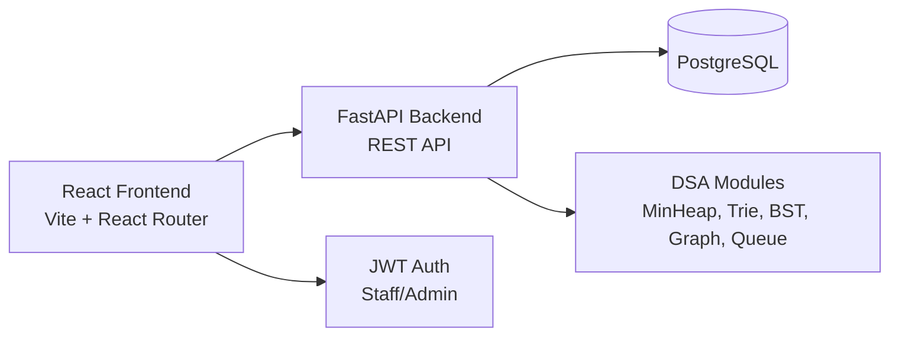

# Restaurant Management System

A full-stack restaurant management application built with FastAPI, PostgreSQL, and React. The project demonstrates real business logic powered by self-implemented data structures and algorithms, including a priority queue, greedy interval scheduler, trie, queue-based router, BST, and graph traversal.


## Overview

This project is a restaurant operations dashboard with:

- Waitlist management using a custom min-heap priority queue
- Reservation table allocation using a greedy interval scheduler
- Menu autocomplete using a trie and category index
- Kitchen order routing with round-robin station queues
- Order history queries using a BST
- Table adjacency and grouping using a graph
- JWT-based staff/admin authentication
- Modern React frontend for all operations

## Architecture



## Project Structure

```text
restaurant_management/
├── backend/
│   ├── app/
│   │   ├── dsa/
│   │   ├── routers/
│   │   ├── auth.py
│   │   ├── database.py
│   │   ├── main.py
│   │   ├── models.py
│   │   └── schemas.py
│   ├── tests/
│   ├── alembic/
│   ├── Dockerfile
│   ├── requirements.txt
│   └── pytest.ini
├── frontend/
│   ├── src/
│   ├── Dockerfile
│   ├── package.json
│   └── vite.config.js
├── docker-compose.yml
├── e2e_tests.py
├── README.md
├── ALGORITHMS.md
└── .env
```

## Prerequisites

- Python 3.11+
- Node.js 18+
- Docker and Docker Compose (optional but recommended)

## How to run locally

### Option 1: Docker Compose (recommended)

```bash
docker compose up --build
```

Then open:

- Frontend: http://localhost:5173
- Backend docs: http://localhost:8000/docs
- PostgreSQL: localhost:5432

### Option 2: Run backend and frontend manually

Backend:

```bash
cd backend
python -m pip install -r requirements.txt
python -m uvicorn app.main:app --host 0.0.0.0 --port 8000 --reload
```

Frontend:

```bash
cd frontend
npm install
npm run dev -- --host 0.0.0.0
```

## How to run tests

Backend unit tests:

```bash
cd backend
python -m pytest -q
```

Optional end-to-end test script:

```bash
python e2e_tests.py
```

## Default login

Create a staff or admin user via the register form in the frontend, or use the API auth routes at `/auth/register` and `/auth/login`.

## Features by page

- Waitlist dashboard: queue ordering and priority scoring
- Table map: allocation and grouping tools
- Menu search: trie-based autocomplete
- Reservation form: create reservation and waitlist links
- Kitchen view: queued stations and order routing
- Order history: date-range order queries
- Login: JWT-based access control

## Notes

This project is designed as a practical DSA showcase, not just a tutorial exercise. The business logic is implemented from scratch rather than delegated to framework-provided utilities when a custom algorithmic solution is more demonstrative.
